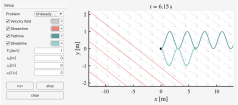
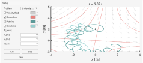
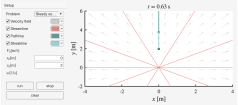

# KinematicsLab: Educational MATLAB App for exploring 2D velocity fields

Interactive MATLAB App to explore **2D velocity fields** and compare:

- **Velocity field** (quiver)
- **Streamlines** (instantaneous, at current time)
- **Pathline** (single Lagrangian tracer)
- **Streakline** (continuous release from a fixed point)

Designed for teaching/learning basic kinematics ideas in fluid mechanics, for both **steady and unsteady** flows.







## Requirements

- MATLAB R2021a or later (for `uifigure`, `uiaxes`, and `uicolorpicker` support).

No additional toolboxes are required.

## Run

Clone/download this repository, then in MATLAB:

```matlab
app = KinematicsApp;
```

Use the left panel to choose a flow case and toggle what to display.

## Included flow cases

- Unsteady uniform: \(u = V_0\), \(v = V_0 \sin(\omega t)\)
- Steady uniform: \(u = V_0\), \(v = 0\)
- Steady saddle: \(u = x\), \(v = -y\)
- Steady source: \(u = x\), \(v = y\)
- Steady rotation: \(u = y\), \(v = -x\)
- Steady shear: \(u = V_0\), \(v = V_0 x\)
- Steady cellular: \(u = \cos(\omega x)\), \(v = \sin(\omega y)\)
- Steady Taylor–Green vortex
- Unsteady rotating saddle
- Steady spiral sink (focus)

Streamlines are computed using analytic formulas when convenient, or via **ψ/first-integral contour extraction** for robust visualization in periodic/unsteady cases.

## License

MIT License. See [LICENSE](LICENSE) for details.
